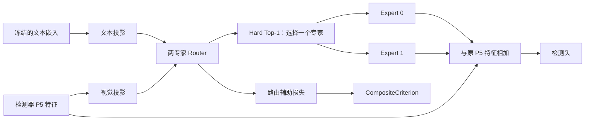

# B1 文本条件路由：8.24 准入 Smoke

课题：B1 文本条件路由 × 开放词汇检测

Owner：SidKC

本目录对应以下准入要求：

> 2 专家小配置能前后向；提交 base/new 数据划分、冻结策略和显存预算。

当前状态：**PASS**。

## 版本

- 公开分支：`exp/b1-admission-smoke`
- 准入标签：`rhino-2026-0824-b1-smoke`
- 官方增量验收基线：Tencent/YOLO-Master `acce839c7e895d6b179de7f7093fa879e237cc7b`
- Smoke 实现起点：`22140b74f1fdf7edc5ead18c3dbebce5e611c212`

实现起点比官方锁定基线多 3 个上游提交，这 3 个提交不计入个人增量贡献。标签固定本页列出的代码、配置、日志和结果，后续不改写。

检出标签：

```bash
git fetch origin tag rhino-2026-0824-b1-smoke
git switch --detach rhino-2026-0824-b1-smoke
```

## 准入材料

| 项目 | 对应材料 | 状态 |
| --- | --- | --- |
| 环境安装 | [environment/README.md](environment/README.md) | 已完成 |
| 基线/最小任务 | 本文“最小任务” | 已完成 |
| 复现命令 | 本文“复现”及 `scripts/b1/run_admission_smoke.py` | 已完成 |
| 配置文件 | [tiny 模型配置](../ultralytics/cfg/models/master/v0_15/det/yolo-master-b1-tiny.yaml)、[COCO 48/17 划分](config/coco_48_17_split.json) | 已完成 |
| 完整日志 | [logs/admission_smoke.txt](logs/admission_smoke.txt) | 已完成 |
| 结果证据 | [results/admission_result.json](results/admission_result.json) | 已完成 |
| 设计说明 | 本文“设计说明” | 已完成 |

## 最小任务

- 模型：由 `yolo-master-tiny.yaml` 派生，在 P5 特征后加入一个 `TextConditionedMoT`。
- 专家：2 个卷积专家，每个样本通过 hard top-1 选择其中一个。
- 输入：随机 `64 × 64` 图像，batch 1/2；文本条件为 `[D]` 或 `[B,D]` 张量。
- 冻结项：文本条件不加入优化器，传入路由器前执行 `detach`。
- 检查项：检测器前向、检测损失反向、参数更新、辅助损失计数，以及两个专家能否分别执行和更新。

## 复现

在仓库根目录执行：

```bash
conda activate yolo_master_b1
python scripts/b1/run_admission_smoke.py
```

安装开发依赖后也可以运行：

```bash
python -m pytest -q \
  tests/test_mixture_loss_composition.py \
  tests/test_text_conditioned_mot.py
```

预期结果：8 个测试全部通过。

## 结果

| 检查项目 | 环境 | 结果 |
| --- | --- | --- |
| 检测器前后向 | CPU，真实 `DetectionModel`，batch 1/2 | 8/8 测试通过；检测损失可以反向传播并更新参数；辅助损失每步只计入一次 |
| 两个专家分别执行 | CPU，真实 `DetectionModel` | 直接设置路由器参数后，expert 0 和 expert 1 都能被选中并完成参数更新 |
| 双专家 CUDA 检查 | NVIDIA A100-PCIE-40GB，PyTorch 2.4.1+cu121，4 seeds × 160 steps | 4/4 seed 中两个专家都获得数值正常且不为零的梯度和参数更新；冻结 prompt 保持不变 |

## 数据划分

`config/coco_48_17_split.json` 采用 OVR-CNN/Bansal COCO 协议：48 个 base 类、17 个 new 类、15 个 unused 类。配置同时记录 COCO annotation `category_id` 和连续的 `coco80_id`；三组互不重叠且合计 80 类。

## 冻结策略

| 组件 | Smoke 中的设置 | 检查方法 |
| --- | --- | --- |
| CLIP/SigLIP 文本编码器 | 冻结并保持 eval；可预先编码文本后卸载 | 参数 `requires_grad=False`，grad 为 `None` |
| 缓存文本嵌入 | 不加入优化器；传入路由器前执行 `detach` | 测试前后内容不变，输入无梯度 |
| 文本投影、视觉投影和 Router | 训练 | 梯度数值正常且不为零，优化后参数发生变化 |
| Expert 0/1 | 训练 | 分别选中两个专家时，对应参数均能获得梯度并更新 |
| 视觉主干和检测头 | 冻结 | 不加入优化器，grad 为 `None`，测试前后参数不变 |

## 显存预算

- 参考卡：RTX 4090 24 GiB。
- 单卡 `max_memory_reserved` 上限：19.2 GiB（物理显存的 80%）。
- 预留 4.8 GiB，用于 CUDA context、临时 workspace 和显存碎片。
- A100 组件 Smoke 实测峰值：17.79 MiB allocated / 22.0 MiB reserved。
- 完整检测器测量固定模型、batch、图像尺寸、精度和优化器；不同型号 GPU 的结果分开记录。

## 风险与降级

| 风险 | 判断依据 | 处理方式 |
| --- | --- | --- |
| 文本和视觉特征的数值尺度不一致 | Router 输出变化很小，或者训练中出现非有限数值 | 保持文本编码器和视觉主干冻结，只训练投影层、Router 和专家；先在 tiny 配置上定位问题 |
| 专家使用过度集中 | 训练过程中长期只选择同一个专家 | 回到两专家最小配置，分别确认两个专家可以执行和更新，再记录训练后的专家使用情况 |
| 完整检测器超过显存预算 | `max_memory_reserved` 高于 19.2 GiB | 保持两专家结构不变，降低 batch 或图像尺寸，并重新记录实际配置和峰值显存 |
| 文本路由没有带来检测收益 | 相同评测设置下，加入文本条件后检测指标没有改善 | 降级为文本条件、Router 分数和专家选择之间的关系分析，如实报告结果，不宣称性能提升 |

## 设计说明



| 模块 | 作用 | Smoke 中是否训练 |
| --- | --- | --- |
| 文本投影 | 将文本嵌入转换到 Router 使用的维度 | 是 |
| 视觉投影 | 从 P5 特征提取 Router 使用的视觉信息 | 是 |
| 两专家 Router | 根据文本和视觉信息为两个专家打分 | 是 |
| Expert 0/1 | 处理 P5 特征；每个样本只执行被选中的一个专家 | 是 |
| 检测器主干和检测头 | 提供视觉特征并计算检测损失 | 否 |
| 路由辅助损失 | 计算并记录当前训练步的辅助损失 | 随 Router 一起计算 |

实现约定：

1. 文本条件通过 batch 字段传入模型，不使用全局变量。
2. 每个样本只执行一个专家；日志记录两个专家分别被选择和跳过的次数。
3. 路由辅助损失只在训练时记录，由 `CompositeCriterion` 在每一步读取一次。
4. 检测损失为向量时，辅助损失只加入一次。
