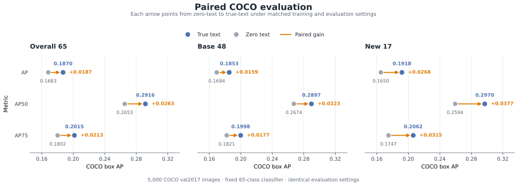
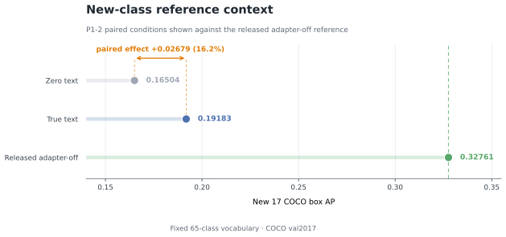

# B1 P1-2 Text-Conditioned Routing Experiment

[中文版](b1_p1_2_text_causal.zh-CN.md)

- **Status:** P1-2 complete
- **Report date:** 2026-08-31
- **Implementation revision:** `47ac2ecd27a4278aee7bda34a63ab108d4719e65`
- **Protocol:** one seed, 20 training steps per arm, full COCO `val2017` evaluation

## Result overview

P1-2 completed a paired `true-text` versus `zero-text` experiment on the released unfused YOLOE-26n detector. The detector core, open-vocabulary classifier, adapter initialization, image order, optimizer, loss, and training budget were identical in the two arms; the Router condition was the only treatment.

Real Router text changed the Router logits, changed the hard Top-1 expert on 10 of 40 paired opportunities, and changed 66,725 of 650,000 elements in the fixed-probe detector output. Both trained adapters then completed the same 5,000-image COCO evaluation.

On the 17 new classes, `true-text` reached AP `0.19183`, compared with `0.16504` for `zero-text`. The paired difference was `+0.02679`, or 2.68 AP points and approximately 16.2% relative to the zero-text result. Positive differences were also measured for overall65 and base48 across AP, AP50, and AP75.

## Experimental question

With the released unfused open-vocabulary detector, adapter initialization, data order, and 20-step training budget held fixed, does real Router text rather than a zero condition change routing and propagate to detector outputs?

Before the paired result was observed, the experiment fixed two readouts for this question: a nonzero paired Router-logit effect and a nonzero fixed-probe detector-output effect while the open-vocabulary classifier remained unchanged.

## Implementation

P1-2 adds an optional text-conditioned adapter at the detector's P5 feature level:

- `TextConditionedMoT` contains two experts and uses sample-level hard Top-1 routing.
- Router conditions and classifier text embeddings use separate inputs, keeping the 65-class detector vocabulary fixed across the intervention.
- The released YOLOE detector core and classifier are frozen and remained bytewise unchanged.
- The optimizer receives only adapter parameters.
- The routing auxiliary loss is published and consumed once per training step, with duplicate and stale consumption recorded.
- Adapter-off loading preserves the released model structure and checkpoint key layout.

## Paired protocol

The Router condition was the only difference between the two arms:

- **true-text:** the frozen real prompt condition selected by the fixed schedule;
- **zero-text:** an all-zero tensor with the same shape, dtype, device, and batch expansion.

Both arms used the same released unfused YOLOE-26n parent, a bytewise-identical initial adapter state, seed `0`, 20 optimizer steps, batch size `2`, image size `320`, and AdamW with learning rate `0.001` and zero weight decay. Hard Top-1 routing was active for all 20 steps. Image IDs, condition schedule, optimizer, loss, and sample order were paired exactly. The arms ran serially on one RTX 4090 without DDP.

Formal evaluation used the same frozen 65-class classifier and all 5,000 COCO `val2017` images. Both arms used image size `640`, confidence threshold `0.001`, IoU threshold `0.7`, maximum detections `300`, and batch size `1`.

### The 65-class evaluation partition

This report uses the frozen Bansal/OVR-CNN COCO 48/17 class partition. The three metric groups are not different models or independent experiments; they are three COCOeval views of the same predictions from the same 65-class classifier:

- **Base 48:** the 48 base/seen classes. Under the frozen protocol, these classes provide positive training annotations; this view measures detection quality on training-visible categories.
- **New 17:** the 17 new/novel/unseen classes. They provide no positive training annotations but remain in the same frozen 65-class output vocabulary; this view measures open-vocabulary generalization to training-unseen categories.
- **Overall 65:** the union of Base 48 and New 17, which is the full evaluated class set for this open-vocabulary task; this view measures aggregate detection quality over the frozen task.

Thus, `Overall 65 = Base 48 + New 17` is a class-set relationship. Overall 65 AP is recomputed by COCOeval over the 65-class union; it is not the simple arithmetic mean of Base 48 AP and New 17 AP. The remaining 15 COCO categories are outside the protocol's training labels, output mapping, and evaluation set, so Overall 65 does not mean the full COCO 80 classes.

## Routing-to-detection evidence

Both arms completed all 20 optimizer steps. Both experts received nonzero task gradients and parameter updates. Auxiliary publication and consumption were `20/20` in each arm, with zero duplicate or stale records. The detector core and classifier remained bytewise unchanged, and the initial adapter state and paired sample order were identical.

The paired Router-logit distances were L1 `2.43882` and L2 `0.35561`. Hard Top-1 selection changed on `10/40` opportunities (`25%`). The fixed-probe output changed in `66,725/650,000` elements (`10.27%`), with L2 distance `4,196.37` and Linf distance `313.51`.

## Full COCO evaluation

The two trained adapters completed evaluation with the same frozen 65-class classifier over all 5,000 COCO `val2017` images.



*Figure 1: COCO box AP, AP50, and AP75 for the same 65-class predictions, viewed over all task classes (Overall 65), training-seen classes (Base 48), and training-unseen classes (New 17). Every displayed paired difference favors true-text.*

The AP differences were `+0.01875` on overall65, `+0.01590` on base48, and `+0.02679` on new17. On new17, the AP50 difference was `+0.03765` and the AP75 difference was `+0.03146`.

## New-class reference context

The released adapter-off substrate was also evaluated with the same frozen 65-class vocabulary and produced new17 AP `0.32761`. Figure 2 places the completed paired P1-2 measurement on that established new-class scale.



*Figure 2: New17 AP for the two P1-2 Router conditions and the released adapter-off reference. The bracket marks the measured true-text versus zero-text effect.*

## Completed artifacts

- A two-expert text-conditioned P5 adapter integrated with the real YOLOE detector.
- Contract tests for Router conditions, routing auxiliary-loss consumption, frozen components, checkpoint compatibility, and detector integration.
- Paired 20-step `true-text` and `zero-text` training results with identical initialization and sample order.
- A complete 5,000-image COCO overall65/base48/new17 evaluation for both trained adapters.
- A machine-readable [result summary](b1_p1_2_text_causal_results.csv) and a reproducible figure generator.

## Engineering record

The first formal-evaluation attempt stopped before inference because the isolated evaluator dependency was unavailable. A run-local evaluator overlay supplied the verified dependency, and the second attempt completed the frozen evaluation protocol. The two attempts and their terminal receipts were preserved separately.

## Reproduction

The public reproduction anchors are the implementation revision above, the paired training settings, the fixed COCO evaluation protocol, and the machine-readable result summary. Raw predictions, checkpoints, and execution receipts are preserved in experiment storage.

The figures are generated from the result summary:

```bash
python scripts/plot_b1_p1_2_text_causal.py \
    --results-csv reports/b1_p1_2_text_causal_results.csv \
    --output-dir reports/figures
```
