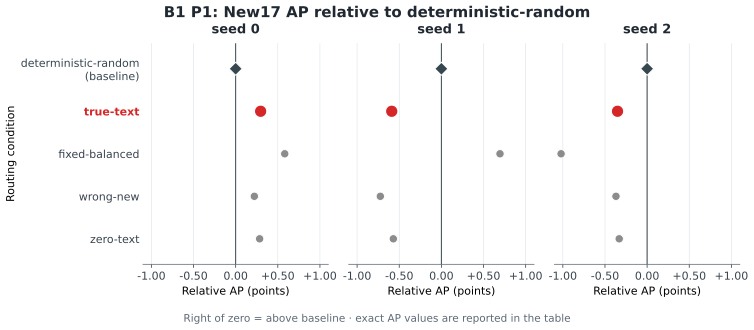
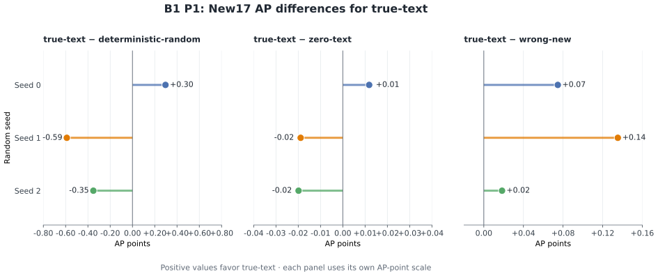

# B1 P1 文本条件路由归因报告

- **阶段：** B1 P1
- **报告日期：** 2026-09-04
- **实现版本：** `47ac2ecd27a4278aee7bda34a63ab108d4719e65`
- **评测规模：** 3 个 seed、15 个实验条件、5,000 张 COCO `val2017` 图像

## 阶段问题

在目标检测模型架构、类别划分、训练预算和评测流程都固定的条件下，真实文本条件相对于固定规则产生的随机专家选择，是否能在多个 seed 上带来稳定的端到端检测收益？在同一个训练后模型状态上改变文本条件，是否会改变模型输出和检测质量？

## 实验设置

为了方便大家了解，本文在相关术语第一次出现的地方说明其在本阶段中的含义。实验沿用 P0（前一阶段基线阶段）固定的 COCO 48/17 开放词汇协议。这里的“开放词汇”表示模型使用文本类别信息评测未在训练中直接出现的类别；COCO `val2017` 是 COCO 通用目标检测数据集的验证集，本报告使用其中的 5,000 张图像。

评测对象是 detector（目标检测模型），模型为每张图像输出目标位置和类别。65 个评测类别分为 48 个训练可见类别（Base48）和 17 个训练未见类别（New17），本报告主要观察 New17。全部图像使用同一个 65 类词表、原始 COCO 类别编号和固定的目标检测评测流程。

训练使用三个 seed（`0/1/2`）和三种训练条件：

- **true-text：** 使用预先固定的选择表选出的真实文本条件；
- **deterministic-random：** 使用确定性的随机 assignment；
- **fixed-balanced：** 使用与图像无关的固定均衡 assignment。

这里的 condition 是提供给文本条件路由器的输入条件；assignment 是每个样本最终选择的专家。`deterministic-random` 是由固定规则产生的随机选择，`fixed-balanced` 是固定且尽量均衡的选择。`true-text` 是与目标类别相关的真实文本条件，`zero` 是形状和数据类型相同但数值全为零的输入，`wrong-new` 是与目标类别不匹配的错误 New 类文本条件。

每个训练条件都使用同样的训练预算，训练一个包含两个 expert 分支的 adapter（插入 detector 的可训练模块）256 步；expert 是处理特征的模型分支。训练完成后，true-text 条件对应的模型状态分别使用目标真实文本（`true-new17`）、全零文本（`zero`）和错误 New 类文本（`wrong-new`）三种文本条件评测，因此共得到 15 个实验条件。

三个 seed 是控制随机初始化和随机过程的编号，用于观察结果是否随初始化改变。

## 结果

### 主要比较：跨 seed 的真实文本与确定性随机 assignment

本阶段关注的是：真实文本相对于确定性随机 assignment 的方向，能否在不同 seed 间保持一致。这里的 AP 是在 IoU（预测框与真实框的重叠比例）0.50–0.95 的多个阈值上平均得到的检测质量指标，数值保持 0–1 形式，越高表示检测质量越高；AP50 只在 IoU 0.50 阈值上计算。所有“差值”列统一使用 AP points，即 AP 差值乘以 100，例如 `+0.296` AP points 表示 AP 增加 `0.00296`。完整数值、AP50 和重采样统计量见[机器可读结果表](b1_p1_attribution_closure_results.csv)。

为了突出跨 seed 的稳定性，图 1 以每个 seed 的确定性随机 assignment 为 0，在三个共用同一横轴的面板中展示各条件相对于该基线的位置。红色大圆点是 `true-text` 主比较，灰色小点提供同一尺度下的背景比较，深色菱形标出基线。三个面板共用 AP points 横轴：点在 0 线右侧表示高于基线，左侧表示低于基线；同一行在三个面板中的位置变化用于观察 seed 间的差异。

*图 1：以每个 seed 的确定性随机 assignment 为 0 的 New17 AP 相对差值点图。三个面板分别对应 seed 0、1、2，共用同一横轴（单位：AP points），竖直 0 线为确定性随机基线。图中不标逐点数值，精确 AP 数值见正文表格。*

主指标为 New17 AP 的真实文本条件与确定性随机 assignment 的差值：

| 随机 seed | 确定性随机 assignment 的 New17 AP | 真实文本条件（true-text）的 New17 AP | 差值：真实文本 − 确定性随机（AP points） |
| --- | ---: | ---: | ---: |
| 0 | 0.275366 | 0.278330 | +0.296 |
| 1 | 0.289444 | 0.283553 | -0.589 |
| 2 | 0.279803 | 0.276293 | -0.351 |
| **平均差值** | — | — | **-0.215** |

一个 seed 中真实文本结果更高，另外两个 seed 中更低；三个 seed 的方向不一致，平均差值为负。因此，在本阶段的固定设置下，没有观察到稳定的真实文本检测优势。

### 改变文本条件后的差值

“同一 checkpoint”表示模型已经训练完成后只改变输入文本条件，不重新训练模型；checkpoint 是训练过程中保存的模型状态。与之相对，真实文本和确定性随机的比较同时改变了训练条件和专家选择，因此这里用它展示总体差异，而不是只归因于文本输入。

*图 2：三个 seed 下真实文本条件相对于三种比较条件的 New17 AP 差值，单位为 AP points。真实文本与确定性随机的比较是总体差异；全零和错误文本比较来自同一 true-text checkpoint。为保证小差值可读，三个面板按各自数值范围显示。*

| 随机 seed | 真实文本条件（true-text）的 New17 AP | 全零文本条件（zero）的 New17 AP | 差值：真实文本 − 全零（AP points） | 错误文本条件（wrong-new）的 New17 AP | 差值：真实文本 − 错误文本（AP points） |
| --- | ---: | ---: | ---: | ---: | ---: |
| 0 | 0.278330 | 0.278212 | +0.012 | 0.277583 | +0.075 |
| 1 | 0.283553 | 0.283743 | -0.019 | 0.282200 | +0.135 |
| 2 | 0.276293 | 0.276491 | -0.020 | 0.276109 | +0.018 |
| **平均差值** | — | — | **-0.009** | — | **+0.076** |

在同一 checkpoint 上改变文本条件会改变 detector output（预测框、类别和置信度）以及 New17 AP。置信度是模型对每个预测的分数。真实文本相对于全零条件在三个 seed 中有一正两负；相对于错误文本条件在三个 seed 中均为正，但差值幅度较小。真实文本相对于随机 assignment 的差值则随 seed 改变方向。

### 固定专家选择的结果

| 随机 seed | 差值：固定均衡 assignment − 真实文本条件（AP points） | 差值：固定均衡 assignment − 确定性随机 assignment（AP points） |
| --- | ---: | ---: |
| 0 | +0.286 | +0.583 |
| 1 | +1.285 | +0.695 |
| 2 | -0.670 | -1.021 |
| **平均差值** | **+0.300** | **+0.086** |

这里的 fixed-balanced assignment 是预先固定且尽量均衡的专家选择。它在前两个 seed 中高于对应条件，在第三个 seed 中低于对应条件。这个现象表明最终的专家选择结果会随 seed 改变。

### 训练与推理中的专家使用

9 个训练条件都完成了 256 步训练；两个专家都收到训练信号并发生参数更新。下面的“被选比例”表示 hard Top-1 assignment 选择两个专家的频率，Expert 0 和 Expert 1 只是两个专家分支的编号：

| 随机 seed | Expert 0 被选比例 | Expert 1 被选比例 |
| --- | ---: | ---: |
| 0 | 99.960% | 0.040% |
| 1 | 0.140% | 99.860% |
| 2 | 0.000% | 100.000% |

训练中两个专家都获得了学习信号，而每个 seed 的推理几乎都由一个专家主导。

## 阶段结论

P1 解决了文本条件路由是否进入 detector 结果路径，以及这种影响是否形成稳定检测收益这两个问题。结果表明，文本条件能够改变路由相关输出，并在同一 checkpoint 上带来可测但幅度较小的质量变化；真实文本相对于确定性随机 assignment 则没有在三个 seed 上形成稳定的 New17 AP 优势。由此，当前阶段观察到的是一个真实存在但尚未转化为稳定检测收益的文本条件信号。

## 数据与图表

图 1 和图 2 由[绘图脚本](plot_b1_p1_attribution_closure.py)直接读取[结果 CSV](b1_p1_attribution_closure_results.csv)生成，输出格式为 SVG。结果表同时保留 New17 AP、AP50、配对差值和图像簇重采样统计量。
