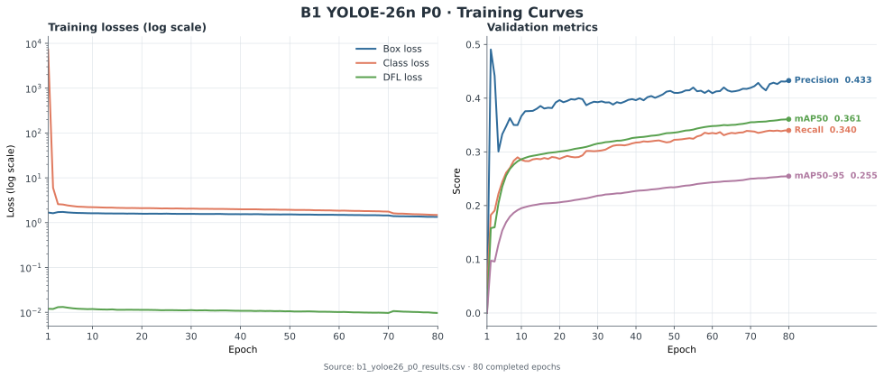
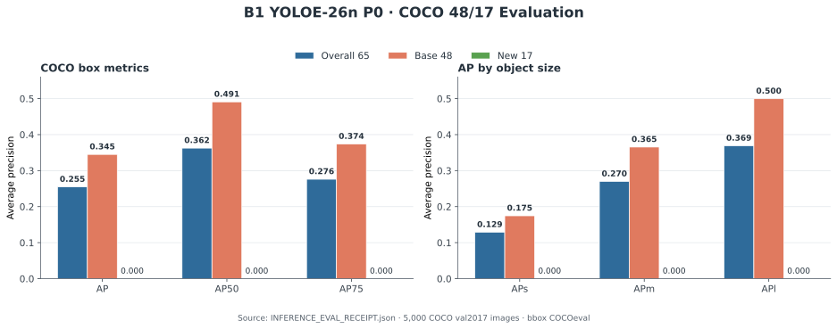
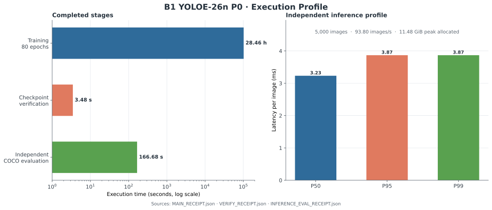

# B1 YOLOE-26n P0 开放词汇基线

[English](b1_yoloe26_p0_baseline.md)

- **状态：** P0 已完成
- **完成日期：** 2026-08-29
- **源码版本：** `4c2dada8a29ae235de44a4df757f2546658cf178`
- **里程碑标签：** `rhino-2026-0829-b1-yoloe26-p0-report-complete`

## 里程碑概述

P0 已完成。冻结的 YOLOE-26n 路径成功产出了可加载的 checkpoint、独立推理结果，以及 COCO 48 个 base 类、17 个 new 类和 65 类并集的评测指标。因此，本次运行建立了一个可复现的开放词汇检测基线，并闭合了 P0 的完整执行链路。

在冻结的 new-class 评测中，模型没有输出 new-class 预测，AP 为 `0.00000`。这一结果与 base48 AP `0.34494` 共同构成了后续研究的基线：当前训练路径已经能够稳定学习 base 类，但尚未在 new 类上产生有效检测。

## 科学问题

在固定的官方 YOLOE-26n 实现和 checkpoint 上，仅使用 COCO base 类训练，能否获得一个可以在独立进程中加载的 checkpoint，并基于真实模型输出，按照冻结的 COCO 48/17 开放词汇划分完成评测？

P0 使用一个模型规模、一个 seed 和一个主训练配置，重点是建立可重复的基线，并跑通训练、checkpoint、独立推理和评测的完整链路。

## 官方 YOLOE 契约

实验遵循仓库中的 [YOLOE 官方文档](../docs/en/models/yoloe.md)：检测微调先通过 YAML 初始化检测架构，再加载相同规模的已发布 segmentation checkpoint，并使用 `YOLOEPETrainer`。

```python
from ultralytics import YOLOE
from ultralytics.models.yolo.yoloe import YOLOEPETrainer

model = YOLOE("yoloe-26n.yaml")
model.load("yoloe-26n-seg.pt")
model.train(
    data="coco48_base.yaml",
    epochs=80,
    patience=10,
    imgsz=640,
    batch=16,
    optimizer="auto",
    amp=True,
    deterministic=True,
    seed=42,
    workers=4,
    cache=False,
    trainer=YOLOEPETrainer,
)
```

本次运行在 prompt fusion 后进行全参数微调，没有使用文档中独立的 linear-probing 配方。四张同类 GPU 上的全局 batch 为 16，即每个 rank 的 batch 为 4。

## 冻结的评测协议

类别划分沿用 [OVR-CNN](https://github.com/alirezazareian/ovr-cnn) 使用的 Bansal COCO 48/17 split：

- 训练只保留 48 个 base 类的标注，并删除不再包含任何 base 类标注的图像。
- 融合后的模型词表顺序固定为 48 个 base 类，随后是 17 个 new 类。
- 17 个 new 类不接收正训练标注，但仍保留在冻结的 65 类输出词表中。
- 其余 15 个 COCO 类不进入训练标签、输出映射和评测。
- 评测覆盖全部 5,000 张 COCO `val2017` 图像，并使用原始 COCO category ID。
- 同一个预测文件通过 `pycocotools.COCOeval(iouType="bbox")` 分别评测三次：`overall65`、`base48` 和 `new17`。

本文将 new-class 指标记为**冻结 65 类词表、new 类零正标签 AP**。

## 实验结果

训练在约 `28.46 小时`内完成全部 80 个 epoch，并产出 `best.pt` 和 `last.pt`。一个独立进程加载 `best.pt`，验证融合后的 65 类 head，完成单次 forward，随后执行完整 validation inference。



*图 1：由 80 个 epoch 的[逐轮训练指标 CSV](b1_yoloe26_p0_results.csv)绘制的训练损失与 validation 指标；损失图使用对数纵轴，以同时呈现不同量级的三项损失。*

| 评测子集 | 图像数 | GT boxes | 预测数 | AP | AP50 | AP75 |
| --- | ---: | ---: | ---: | ---: | ---: | ---: |
| 全部 65 类 | 5,000 | 33,152 | 551,220 | 0.25472 | 0.36249 | 0.27607 |
| 48 个 base 类 | 5,000 | 28,538 | 551,220 | 0.34494 | 0.49088 | 0.37384 |
| 17 个 new 类 | 5,000 | 4,614 | 0 | 0.00000 | 0.00000 | 0.00000 |



*图 2：overall65、base48 和 new17 的 COCO box AP，以及按目标尺寸划分的 AP。*

独立推理处理 validation set 的吞吐约为 `93.80 images/s`，GPU 峰值 allocated memory 约为 `11.48 GiB`。



*图 3：训练、checkpoint 验证和独立 COCO 评测的实际耗时，以及 5,000 张 validation 图像上的推理延迟分位数。*

## P0 交付结果

- 一套遵循官方 YOLOE 检测微调路径的 48/17 训练配置。
- 完成 80 个 epoch 的训练结果，以及可独立加载的 `best.pt` 和 `last.pt`。
- 覆盖全部 COCO `val2017` 图像的 overall65、base48 和 new17 评测结果。
- 固定的类别顺序、COCO category ID 映射和评测流程。
- 可复用的训练、checkpoint、独立推理和 COCO 评测链路。

## 工程修复说明

执行中完成了两项工程修复：

- 直接选择 `YOLOEPETrainer`，移除重复的 trainer override。
- 将长序列 validation inference 改为有界分块，并在分块之间重置 predictor；同时隔离与现有安装冲突的 COCO evaluator 依赖。

## 结果解读

P0 最直接的观察是 base 类与 new 类之间的明显差异：base48 AP 达到 `0.34494`，而 new17 没有产生预测。由此得到一个清晰的基线状态——官方 YOLOE-26n 检测微调路径在当前 48/17 设置下完成了 base 类学习，但 new 类检测仍然为空。后续工作可以围绕这一差异分析训练目标、词表融合和条件计算之间的关系。

## 复现信息

本次结果的复现锚点包括本文顶部的源码版本、官方 YOLOE 训练契约、上文列出的训练配置、冻结的 COCO 48/17 策略，以及标准 COCO bounding-box 评测。精确的类别名称与 category ID 映射在训练前固化为机器可读的 split 文件，并在训练和评测过程中保持一致。

报告中的图表由 `scripts/plot_b1_yoloe26_p0.py` 直接读取运行 receipts 生成：

```bash
python scripts/plot_b1_yoloe26_p0.py \
    --main-receipt <MAIN_RECEIPT.json> \
    --verify-receipt <VERIFY_RECEIPT.json> \
    --eval-receipt <INFERENCE_EVAL_RECEIPT.json> \
    --training-csv reports/b1_yoloe26_p0_results.csv \
    --output-dir reports/figures
```
